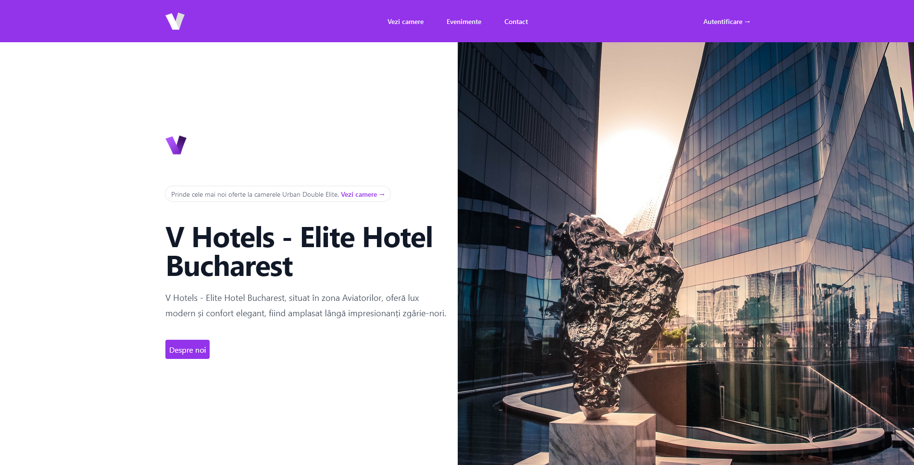

# Elite Hotel Bucharest - Vârful eleganței urbane
Această aplicaţie ajută la vizualizarea şi rezervarea camerelor şi suitelor hotelului **Elite Hotel Bucharest**, amplasat în zona de nord a capitalei, Aviatorilor. Oferă lux modern și confort elegant, fiind situat lângă impresionanți zgârie-nori şi fiind poziţionat într-o zonă ideală pentru călătoriile în scop de afaceri.

## Demo
Sistemul dispune de mai multe funcţionalităţi, printre care şi autentificarea prin intermediul codurilor QR. Mai jos sunt prezentate câteva demo-uri pentru a demonstra funcţionalitatea acestora.

**Autentificare folosind cod QR**
La înregistrarea unui cont nou pe platforma hotelieră, utilizatorul are posibilitatea de a salva un cod QR generat pe moment. Acesta poate a fi folosit pe viitor pentru autentificarea în sistem într-un mod rapid.

**Rezervare camere şi suite**
Utilizatorii înregistraţi au posibilitatea de a alege o dată de check-in şi check-out, cât şi camera dorită. Preţul este afişat şi actualizat în timp real pentru a oferi cea mai bună experienţă.

## Tehnologii utilizate
Mai jos se regăsesc principalele tehnologii utilizate în realizarea acestui proiect:
 
**Tehnologii Frontend:**

**Tehnologii Backend:**

## Cerinţe
Pentru o funcţionare optimă, proiectul necesită următoarele:

 - PHP 5.6+
 - Extensia  `pdo_sqlite`  activată in fişierul  `php.ini`

## Instalare
Pentru instalarea locală a proiectului, utilizează comanda:
-   `git clone https://github.com/vlaadutz/EliteHotelBucharest`

## Licenţă
Acest proiect este licenţiat sub Licenţa AGPL-3.0 - vezi fişierul LICENSE pentru mai multe informaţii.